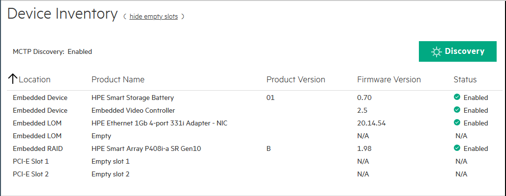
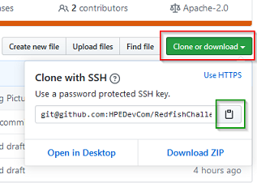
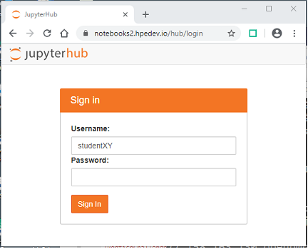
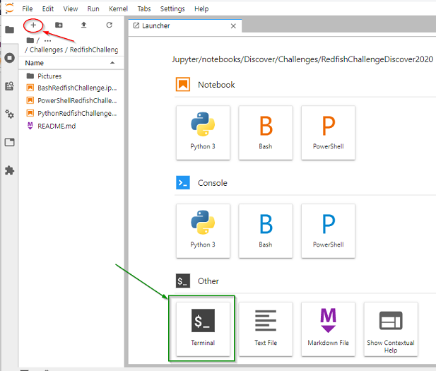
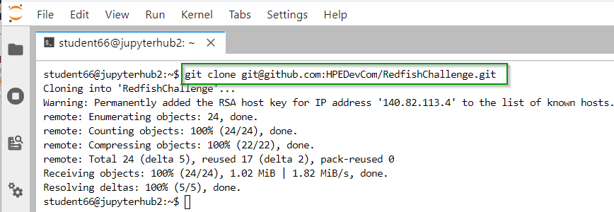
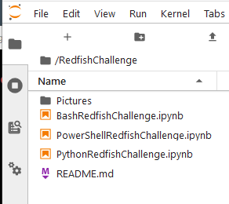

# Welcome to the DISCOVER Hack Shack Redfish Challenge

Version 0.3

This repo provides the instructions and the response form(s) for the HPE Discover Virtual Experience Hack Shack Redfish Challenge.

You will have to fork it to get started.

## Challenge prerequisites

We recommend you attend the following Discover Hack Shack workshops before attempting this challenge:

1. Git 101
2. Hack Shack W482: Introduction to Redfish API Use With PowerShell Python and Bash/cURL

If you have not, make sure you leverage the notebooks provided in your Jupyter environement for reference. 

## Challenge description

The goal of this challenge is to retrieve the information provided in the `System Information --> Device Inventory` view of an iLO 5 with a minimum number of Redfish GET requests in order to delegate a maximum of processing in the remote managed Redfish engine. 

The following screenshot shows the `Device Inventory` list of a HPE DL360 Gen10 server and the properties to retrieve: `Location`, `Product Name`, `Product Version`, `Firmware Version`, `Status`.

In case of tied students, session authenticated programs will get a higher score. Programs implementing good Redfish practises, meaning crawling the Redfish tree to find the resources path instead of assuming a definite location will get, as well a higher score.

For example, a program discovering the list and the names of all the chassis in a server will get a higher score than a program assuming that the first chassis is called `1`, the second `2`...

The formating of the output is not a quality criteria; a raw JSON output is fine.   

### Language choices:

As we have a limited number of languages (kernels) installed in this Jupyter infra, please, use one of the following notebook templates:

* [PowerShell](PowerShellRedfishChallenge.ipynb)
* [Python](PythonRedfishChallenge)
* [Bash/cURL](BashRedfishChallenge.ipynb)

Each of the above templates contains the necessary information to achieve your challenge (i.e. iLO 5 IP address, credentials...)

## Fork the Challenge Repo

We leverage GitHub to distribute and collect your response for this challenge. This means that your reponse will be delivered via a Git Pull Request in this [RedfishChallenge](https://github.com/HPEDevCom/RedfishChallenge) repo. 

But before, **you need to fork** this [Redfish Challenge](https://github.com/HPEDevCom/RedfishChallenge.git) repository.

## Clone the repo in your Jupyter environment 

Once you have a copy of the repo in your own GitHub account, **you have to clone** it into your Jupyter environement: 

0. Copy the Redfish GitHub repo location in **your clipboard**

1. **Log** into your Jupyter environment

2. **Select `Terminal`** at the bottom left of the main `Launcher` pane, . If you don't have any Launcher pane, click on the `+` sign in the upper left of the left pane.

3. Perform the **clone**

Issue the following command in your terminal: 

`git clone git@github.com:HPEDevCom/RedfishChallenge.git`

## Work on your challenge

Once the content of the Redfish Challenge repo is downloaded in your Jupyter account, from the left pane, open your prefered language notebook in Jupyter (`PowerShell`, `Bash` or `Python`). It's now time for you to do real work :-)

## Racing against the clock

Remember that you are working against the clock here. You have 4 hours after we provided you access to the Jyputer account. If your time is running out, make sure you commit and push your changes to your copy of the repo in order to avoid loosing any work.

